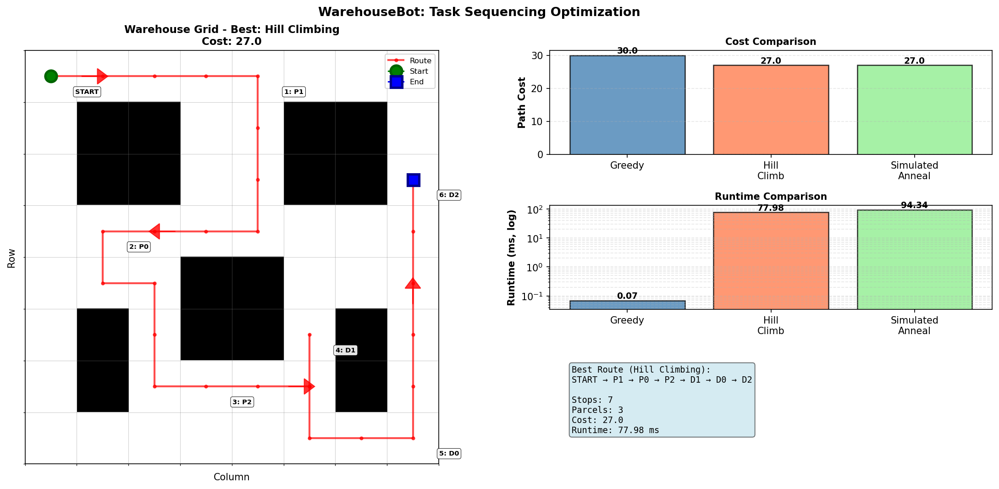
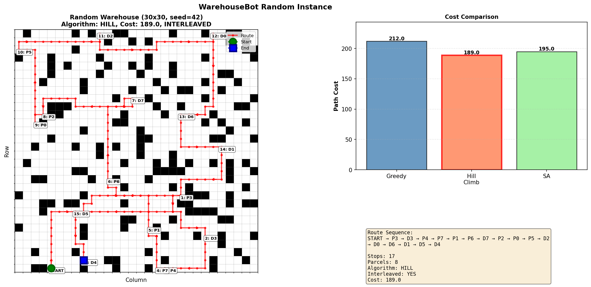

# WarehouseBot: Pick-and-Drop Optimization

**Course:** Artificial Intelligence 1  
**Author:** Apurv Kushwaha  
**Institution:** University of Minnesota Twin Cities  

---

## Overview

This project addresses a **single-robot warehouse pick-and-drop optimization problem**.  
A robot must collect multiple parcels from pickup locations and deliver them to corresponding drop locations while minimizing total travel distance. Each parcel introduces a **precedence constraint**: its pickup must occur before its drop.

The system is implemented as a **two-layer Artificial Intelligence pipeline**:

1. **Path Planning Layer**  
   Uses A* search on a grid-based warehouse map with obstacles to compute shortest paths between all relevant locations.

2. **Task Sequencing Layer**  
   Uses local search algorithms to optimize the visiting order of pickup and drop locations while respecting precedence constraints.

Algorithms implemented and compared:
- Greedy nearest-neighbor baseline
- Hill Climbing with random restarts
- Simulated Annealing

---

## Repository Structure

```
.
├── warehousebot/
│   ├── astar.py              # A* pathfinding on grid maps
│   ├── warehouse.py          # Warehouse layouts and random instance generation
│   ├── cost_matrix.py        # All-pairs shortest path cost computation using A*
│   ├── sequencing.py         # Greedy, Hill Climbing, and Simulated Annealing
│   ├── evaluation.py         # Experiments, statistics, CSV export
│   ├── visualize.py          # Grid, route, and cost visualizations
│   ├── smoke_tests.py        # Basic correctness tests
│   └── __init__.py
├── generate_artifacts.py     # One-command artifact generator
├── results/                  # CSV result tables
├── images/                   # Figures and visualizations
├── logs/                     # Summary statistics
├── report.pdf                # Final project report
└── README.md
```

---

## Software Requirements

- Python **3.8+**
- Required packages:
  - `numpy`
  - `matplotlib`

Install dependencies:
```bash
pip install numpy matplotlib
```

---

## How to Run

### 1. Generate all results and figures (recommended)

This single command reproduces **all experiments, CSV files, and figures** used in the report.

```bash
python3 generate_artifacts.py
```

Outputs:
- `results/` – CSV result tables
- `images/` – figures and visualizations
- `logs/summary.txt` – summarized statistics

---

### 2. Run the main evaluation only

```bash
python3 -m warehousebot.evaluation
```

Optional experiment modes:
```bash
python3 -m warehousebot.evaluation --scaling
python3 -m warehousebot.evaluation --sa-sweep
python3 -m warehousebot.evaluation --ablation
python3 -m warehousebot.evaluation --stress
```

---

### 3. Run basic tests (sanity checks)

```bash
python3 -m warehousebot.smoke_tests
```

These tests verify:
- Correct A* behavior
- Cost matrix symmetry
- Feasible routes from all sequencing algorithms

---

### 4. Generate visualizations manually

Static demo comparison:
```bash
python3 -m warehousebot.visualize --save images/static_comparison.png
```

Random warehouse example:
```bash
python3 -m warehousebot.visualize --random --rows 30 --cols 30 --obstacle 0.20 --parcels 8 --seed 42 --save random.png
```

---

## Results

### Tabular Results

CSV summaries are stored in the `results/` directory. Example:
- `random_trials_15x15_p5_o0.20_seed42.csv` – 30 randomized trials comparing greedy, hill climbing, and simulated annealing.

### Visual Results

The figure below is generated automatically by the project and is also used in the report:



The figure below shows a **larger random warehouse instance (30×30 grid, 20% obstacles, 8 parcels)**.
This example demonstrates scalability and an **interleaved pickup–drop route**, where some deliveries occur
before all pickups are completed while still respecting precedence constraints.




This visualization compares route cost and runtime for all algorithms on a static warehouse instance.

**Key findings:**
- Hill Climbing and Simulated Annealing consistently outperform the greedy baseline
- Typical improvements range from **5% to 12%** depending on instance size
- Hill Climbing provides the best balance between solution quality and runtime

---

## Design Notes

- Clean separation between geometric planning (A*) and combinatorial optimization
- Deterministic experiments with fixed random seed (default: 42)
- Fully self-contained; no external datasets required

---

## References

1. Apurv Kushwaha. *WarehouseBot: Pick-and-Drop Optimization*. Course Project Report, Artificial Intelligence 1, University of Minnesota Twin Cities, 2025.
2. Zhou, X., Li, Y., Dong, Y., & Gu, J. (2014). Routing Optimization of Intelligent Vehicle in Automated Warehouse. *Discrete Dynamics in Nature and Society*.
3. Wang, H., & Chen, W. (2021). Task Scheduling for Transport and Pick Robots in Logistics. *Autonomous Intelligent Systems*.
4. Roodbergen, K. J., & De Koster, R. (2001). Routing Order Pickers in a Warehouse with a Middle Aisle. *European Journal of Operational Research*.
5. Sung, J., & Jeong, B. (2014). An Adaptive Evolutionary Algorithm for Traveling Salesman Problem with Precedence Constraints. *The Scientific World Journal*.

---

## License

This project is provided for academic coursework use only.

